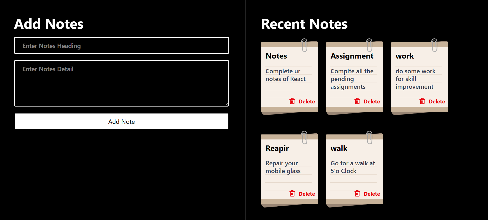

# React Chapter 13 – Project: Notes App 📝⚛️

This chapter is a hands-on project applying **form handling in React** — using two-way data binding to keep a controlled input in sync with state, then building it out into a working notes app.

---

## 📌 About This Chapter

One example is written in `App.jsx`, showing a controlled text input bound to state via `value` and `onChange`, submitted through a custom handler.

---

## 🚀 What I Learned

* How to set up **two-way binding** on an input using `value` + `onChange`
* How the input and state stay in sync in both directions as the user types
* How to reset an input field by resetting its bound state
* Combining two-way binding with `e.preventDefault()` to handle submission without a page reload

---

## 🧩 Concepts Covered

### 🔗 What is Two-Way Binding?

Two-way binding means a form element's displayed value and a piece of state stay in sync in **both directions**:

* **State → Input:** the input's `value` prop is set from state, so whatever the state holds is what the input shows.
* **Input → State:** the input's `onChange` event updates that same state with whatever the user types.

So data doesn't just flow one way (state controlling the UI) — user interaction also flows back and updates the state, which then re-renders the UI. This is why it's called "two-way": a change on either side (state or input) is reflected on the other. In React this is achieved manually by pairing `value={state}` with `onChange={e => setState(e.target.value)}` — this pattern is often called a **controlled component**, because React (via state) fully controls the input's value instead of the DOM managing it on its own.

### Two-Way Binding
```jsx
const [title, setTitle] = useState('')

const submit = (e) => {
  e.preventDefault();
  setTitle('')
  console.log("Form Submitted by", title)
}

return (
  <div>
    <form onSubmit={(e) => {
      submit(e)
    }}>
      <input type="text"
        placeholder='Enter your Name'
        value={title}
        onChange={(e) => {
          setTitle(e.target.value);
        }}
      />
      <button>Submit</button>
    </form>
  </div>
)
```

#### 🔁 Flow of Two-Way Binding in This Code

1. `title` state starts as an empty string, and the input's `value` is bound to `title` — so the input always displays whatever `title` currently holds.
2. User types a character → the input fires its `onChange` event.
3. `onChange` calls `setTitle(e.target.value)`, updating `title` to the input's current text.
4. React re-renders `App` with the new `title` value, which flows back into the input's `value` prop — the input visually updates to show what was typed.
5. Steps 2–4 repeat on every keystroke, keeping the input and the `title` state permanently in sync in **both directions**: state → input (via `value`) and input → state (via `onChange`). This is what makes it "two-way."
6. On submit, `e.preventDefault()` stops the page reload, the current `title` is logged, and `setTitle('')` resets both the state and (because of the binding) the visible input back to empty.

---

## 🏗️ Project Flow

The notes feature in this chapter was built up in three stages:

1. **UI first** — the layout was created first: the input field, submit button, and the list container that would eventually hold the notes, all with no working logic behind them yet.
2. **Add note functionality** — the "Add Note" button was wired up next, using two-way binding (`value` + `onChange`) to capture input text in state, then appending it to a notes array on submit.
3. **Delete note functionality** — a delete button was added to each note, using JavaScript's `splice()` method to remove a note from the array by its index, so each note can be deleted individually.

---

## 📸 Screenshots



---

## 🛠️ Technologies Used
* React.js · JavaScript (ES6+) · HTML5 · CSS3

---

## 🎯 Learning Outcome
After this chapter, I can:
* Implement two-way binding on a controlled input using `value` and `onChange`
* Explain the full data flow of two-way binding, from keystroke to state update to re-render
* Reset a controlled input by resetting its bound state
* Describe a UI-first build order: layout → add functionality → delete functionality (via `splice`)